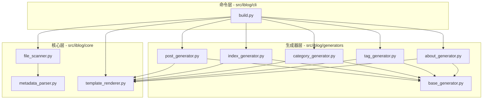

# iblog

`iblog` 是一个基于 Python 的轻量级静态博客生成工具。它能够将带有 Frontmatter 元数据的 Markdown 文件转换为美观、结构化的 HTML 页面。

## 🚀 核心功能

- **Markdown 转换**：支持标准的 Markdown 语法解析。
- **元数据支持**：自动提取文章标题、日期、分类、标签等 YAML 元数据。
- **文章置顶**：支持通过 `pinned: true` 将重要文章置顶到首页最上方。
- **目录大纲**：自动为博客文章生成左侧可点击跳转的目录，支持滚动高亮当前章节。
- **多视图生成**：
  - **首页**：自动生成文章列表。
  - **博文页**：独立的文章详情页面，带左侧目录导航。
  - **分类与标签**：自动归档并生成对应的索引与详情页。
  - **关于页面**：支持独立的 `about.md` 转换。
- **三层架构设计**：核心层、生成器层、命令层分离，易于扩展和维护。

## 🛠️ 技术栈

- **环境管理**：[uv](https://github.com/astral-sh/uv)
- **核心库**：
  - `jinja2`: HTML 模板渲染。
  - `markdown-it-py`: 高性能 Markdown 解析。
  - `python-frontmatter`: YAML 元数据解析。
  - `typer`: 命令行交互。
  - `loguru`: 优雅的日志记录。

## 📂 项目结构

```text
iblog/
├── src/
│   └── iblog/         # 主包
│       ├── core/      # 核心逻辑（解析、扫描、渲染）
│       ├── generators/# 页面生成器（首页、文章、分类等）
│       └── cli/       # 命令行接口
├── tests/             # 测试文件
├── templates/         # HTML 模板文件
├── assets/
│   ├── markdown_files/# Markdown 源文件存放处
│   └── html_files/    # 生成生成的 HTML 文件输出目录
└── pyproject.toml     # 项目配置与依赖
```

### 🏗️ 架构图



## 📦 快速开始

### 1. 环境准备

确保已安装 `uv`。如果未安装，可以参考 [uv 官方文档](https://github.com/astral-sh/uv)。

### 2. 安装依赖

在项目根目录下运行：

```bash
uv sync
```

### 3. 构建博客

使用以下命令将 Markdown 文件转换为 HTML：

```bash
uv run iblog -i assets/markdown_files -o assets/html_files
```

- `-i, --input`: 指定 Markdown 源文件目录。
- `-o, --output`: 指定 HTML 输出目录。

你也可以使用 `-m` 方式运行：

```bash
uv run python -m iblog -i assets/markdown_files -o assets/html_files
```

## 📝 Markdown 规范

博文应包含 Frontmatter 元数据，示例如下：

```markdown
---
title: 我的第一篇博客
date: 2026-02-13
category: 技术
tags: [Python, 静态博客]
---

这里是博客正文内容...
```

### 文章置顶

如需将重要文章置顶到首页最上方，只需在 Frontmatter 中添加 `pinned: true`：

```markdown
---
title: 重要通知
date: 2026-02-13
category: 公告
tags: [通知]
pinned: true  # 置顶文章
---

重要内容...
```

**置顶规则**：
- 置顶文章会自动排在首页最上方
- 多个置顶文章之间按日期降序排列（最新的在前）
- 置顶文章具有独特的视觉标识（金色边框和 "📌 置顶" 徽章）

详细说明请参考：[置顶功能使用说明](docs/PINNED_FEATURE.md)

### 博客大纲（TOC）

所有博客文章页面会自动生成左侧可点击的目录大纲：

- 自动提取所有标题（h1-h6）
- 支持多层级嵌进显示
- 点击可快速跳转到对应章节
- 滚动时自动高亮当前章节
- 响应式设计，移动端自动隐藏

详细说明请参考：[TOC功能使用说明](docs/TOC_FEATURE.md)

## 📤 生成的输出结构

构建完成后，输出目录将包含以下内容：

```text
output_dir/
├── index.html           # 博客列表首页
├── blogs/              # 所有博客文章
│   ├── article1.html
│   ├── article2.html
│   └── ...
├── categories/         # 分类页面
│   ├── index.html      # 分类索引
│   ├── 教程.html
│   └── ...
├── tags/               # 标签页面
│   ├── index.html      # 标签云
│   ├── python.html
│   └── ...
└── about/              # 关于页面（如果存在 about.md）
    └── index.html
```

## 🔧 扩展指南

### 添加新的生成器

1. 在 `src/iblog/generators/` 创建新的生成器文件
2. 继承 `BaseGenerator` 类
3. 实现 `generate(posts, output_dir)` 方法
4. 在 `src/iblog/cli/build.py` 中调用新生成器

示例：

```python
from .base_generator import BaseGenerator

class CustomGenerator(BaseGenerator):
    def generate(self, posts: list[dict], output_dir: Path):
        # 实现自定义生成逻辑
        pass
```

### 添加新的元数据字段

在 `src/iblog/core/metadata_parser.py` 的 `validate_metadata()` 方法中处理新字段。

## 🔄 数据流

构建过程遵循以下数据流：

1. **扫描阶段**：`FileScanner` 扫描 Markdown 目录，解析所有文章的元数据和内容
2. **处理阶段**：对文章列表进行排序、分组等处理
3. **生成阶段**：各个生成器根据处理后的数据生成对应的 HTML 页面
   - `PostGenerator`：生成所有博文页面
   - `IndexGenerator`：生成首页
   - `CategoryGenerator`：生成分类索引页和详情页
   - `TagGenerator`：生成标签云和详情页
   - `AboutGenerator`：生成关于页面（如果 about.md 存在）

## ✨ 关键特性

- **标准 src-layout**：采用 Python 社区最佳实践的项目结构
- **命令行入口点**：通过 `pyproject.toml` 配置，支持 `uv run iblog` 启动
- **一次扫描，多次生成**：所有生成器共享同一份文章数据，避免重复 I/O
- **职责清晰**：核心层、生成器层、命令层各司其职，易于维护
- **易于扩展**：添加新视图只需创建新的生成器
- **测试覆盖**：核心层和生成器层都有完善的单元测试

## 🧪 运行测试

```bash
uv run python -m unittest discover tests -v
```

---
*Powered by iblog*
